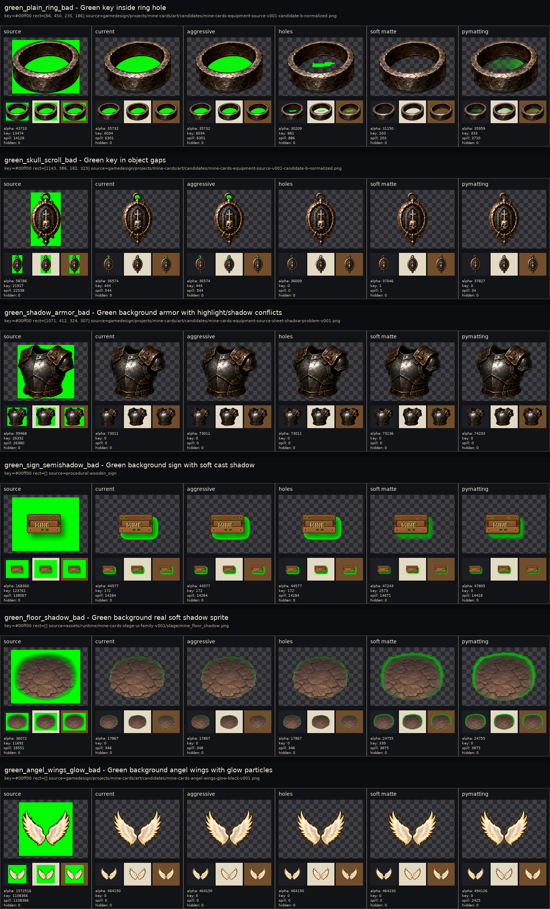
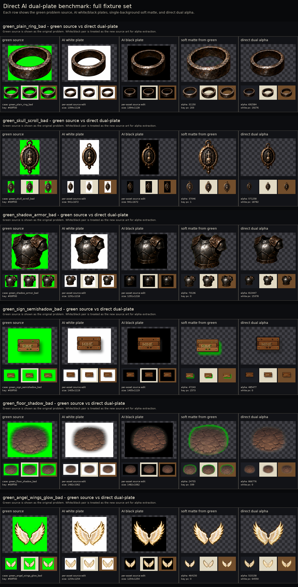

# Вырезание AI-арта с фона: что показал бенчмарк



Проблема оказалась не в том, что "зеленый фон плохо удаляется" вообще. Простые случаи удаляются нормально. Проблема в том, что выбранный key-color попадает внутрь полезного изображения: в дырки, зазоры, антиалиасинг, полутени, soft shadow и glow/particles. Когда цвет уже смешался с пикселями объекта, обычный chroma key не знает, где фон, а где часть арта.

## Что сравнивали

- `source` - исходник на зеленом фоне.
- `current` - текущий консервативный border-connected key: удаляет фон, который связан с краем изображения.
- `aggressive` - тот же путь, но с более заметным despill/decontamination.
- `holes` - дополнительно удаляет точные зеленые дырки внутри bounds.
- `soft matte` - мягкая alpha-маска по расстоянию до key-color.
- `pymatting` - внешний/экспериментальный matte solver через trimap.

## Главный вывод по single-background

`current` и `aggressive` почти не отличаются на этих кейсах. Это важно: aggressive не является отдельным решением, он только чуть сильнее чистит видимый spill. Если зеленый цвет уже сидит в отверстии кольца, в полутени таблички или в мягком краю тени, режим не угадает правильную альфу.

`holes` полезен для чистых внутренних дырок, но может сделать грязную, рубленую альфу. `soft matte` часто лучше спасает форму на одиночном фоне, но на тенях и свечении все еще может оставить зеленый ореол или съесть мягкость. `pymatting` не стал универсальной кнопкой: местами помогает, местами раздувает зеленый/грязный край.

Практическое правило: single-background chroma key можно принимать только после визуального бенчмарка на темном, светлом и теплом фоне. Если есть мягкая тень, glow, частицы или key-color в материале, это risky source, а не "почистим потом".



## Что показал direct dual-plate

Dual-plate работает иначе: мы просим/получаем один и тот же арт на белом и черном фоне, а альфу считаем из разницы двух plate-изображений. Это лучше подходит для soft shadow, glow и particles, потому что полупрозрачность видна как изменение между белым и черным фоном.

Но важная граница: если белую и черную версии делает AI, это уже не гарантированно тот же самый исходник. Модель может немного перерисовать силуэт, сдвинуть объект, изменить яркость или детали. Поэтому production-path тут такой:

1. Берем один зеленый source как edit target.
2. Генерируем white plate из этого source.
3. Генерируем black plate уже из принятой white plate, чтобы пара была ближе между собой.
4. Принимаем эту white/black pair как новый source art.
5. Не переносим маску обратно на старую зеленую картинку.
6. Вырезаем alpha из самой пары.
7. Проверяем результат на темном, светлом и теплом фоне.
8. Если пара заметно разъехалась по форме/позиции, перегенерируем пару, а не лечим alignment-скриптами.

Нельзя делать один общий sheet на много ассетов и потом резать его строками: это проверяет batch-layout и ошибки crop, а не dual-plate pipeline. В исправленном benchmark каждая строка использует отдельные файлы `ai_white_from_source.png` и `ai_black_from_source.png` в папке конкретного ассета.

На кольце dual-plate дает чистую дырку без зеленого центра. На крыльях soft matte по зеленому фону теряет и пачкает свечение, а dual-plate лучше сохраняет glow/particles. Это не делает метод бесплатным: нужна дисциплина промпта и acceptance gate пары. В текущем AI-edit пути почти все ассеты немного перерисовываются, поэтому это не способ получить идеальную маску для старого source. Это способ получить новый source art, который потом можно вырезать качественнее.

## Production-правило для следующего пайплайна

Для обычных предметов без soft effects можно использовать chroma key, но только с safer key-color и обязательным визуальным обзором. Для теней, свечения, частиц, дыма, магии, прозрачного стекла и мягких ореолов надо сразу идти в true alpha или dual-plate. Если true alpha недоступна, dual-plate должен быть отдельным режимом генерации, а не аварийной починкой после плохого зеленого source.

Промпт для второй plate-версии должен быть жестким:

```text
Change only the background.
Preserve subject scale, position, silhouette, details, glow, particles, and shadows.
Do not redraw, improve, simplify, add, remove, crop, rotate, or move the subject.
Background must be perfectly flat #ffffff.
```

Для черной plate-версии меняем только последний цвет на `#000000`.

## Решение

Оставляем три production-режима:

- `border key` для простых твердых предметов.
- `soft matte` как salvage/diagnostic для одиночного фона.
- `direct dual-plate` для soft alpha, shadow, glow и particles.

`aggressive` оставляем как диагностический флаг внутри текущего key path, но не продаем его как отдельное качество результата. Если разницы с `current` глазами не видно, в постовых картинках и acceptance-решениях он не должен создавать иллюзию нового решения.
