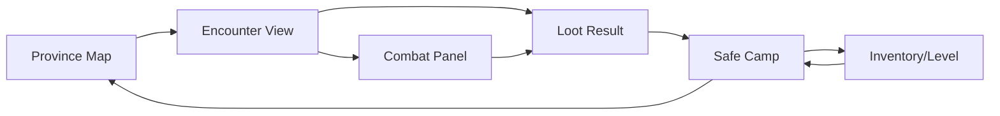

# Fantasy Pocket RPG GDD

## Current Gate

- Concept gate: accepted for compact fantasy RPG and camp-as-preparation.
- Reference gate: compact pass complete.
- Visual gate: first generated art backgrounds and web fake shots created; needs user review.
- Slice gate: first playable slice defined.
- Handoff gate: implementation-ready except command discovery; next implementation chat must discover local build/run commands first.

## Game Summary

A compact fantasy RPG for mobile and PC. The player explores a dangerous province through map nodes and illustrated first-person encounters, gains loot and clues, then returns to safe camp points to recover, craft, equip, speak with companions, and choose the next upgrade.

## First 30 Seconds

1. Player sees `Province Map` with one open route: `Old Road -> Moss-Covered Ruins`.
2. Top bar shows `Health`, `Resolve`, `Supplies`, `Gold`.
3. Quest card says: `Find the missing scout near the old stones`.
4. Player taps `Travel`.
5. Encounter opens: moss road, standing stones, ruin gate, dragon omen in the sky.
6. Player chooses `Search the stones` or `Approach ruins`.
7. Feedback appears: `Found herbs +2`, `Dragon Omen +1`.

## First 5 Minutes

1. Travel to the first ruin.
2. Resolve one event choice.
3. Fight or bypass one enemy through a simple stat check.
4. Loot `Rusty Blade` and `Dragon-Marked Shard`.
5. Health or Resolve drops enough to make camp useful.
6. Safe campfire unlocks after the encounter.
7. In camp, player rests, crafts `Minor Healing Draught`, compares loot, talks to first companion, and chooses `Trail Herbalist I`.
8. Returning to map reveals `Hunter's Ford`.

## Core Loop

```text
choose destination -> encounter/event -> fight/check/choice -> loot/resources/status change -> safe camp preparation -> upgrade/perk/story beat -> unlock next destination
```

## Screen Loop



## Camp Rule

Camp is a preparation/narrative screen, not a base builder.

Access:

- safe map nodes;
- cleared locations;
- campfires, shrines, inns;
- world-map travel pauses.

Not allowed:

- during combat;
- in hostile rooms;
- as a universal escape button from danger.

Camp actions:

- rest and recover;
- craft simple consumables;
- repair/upgrade selected gear;
- level up/perk choice;
- talk to companions;
- inspect dragon relic/mark;
- manage inventory before next expedition.

## Currencies And Stats

- `Health`: combat survival and rest motivation.
- `Resolve`: mental stamina for fear, magic, persuasion, and curses.
- `Supplies`: travel/rest pressure; should never hard-lock the first slice.
- `Gold`: shop, repair, services; light preview in first slice.
- `Herbs`: first crafting resource.
- `Dragon Omen`: mystery/progression flag, not spendable in first slice.

## First Activities

### Travel: Old Road

- Input: tap/click map node.
- Cost: none in tutorial route.
- Reward: enters `Moss-Covered Ruins`.
- UI feedback: route line animates, quest card updates.

### Search: Standing Stones

- Input: tap `Search`.
- Cost: 25% chance to lose 1 Resolve.
- Reward: `Herbs +2`, `Dragon Omen +1`.
- UI feedback: result toast and relic glow.

### Fight: Ruin Wolf / Bandit Scout

- Input: `Attack`, `Defend`, `Use Item`, `Skill`.
- Cost: Health/Resolve risk.
- Baseline: first enemy is `Ruin Wolf`, 12 HP, 4 damage bite.
- Expected win: 3 attacks with `Old Knife` at 5 damage each.
- Reward: `Rusty Blade`, 4 Gold, location progress.
- UI feedback: turn log, enemy health, damage numbers.
- Source: `combat_spec.md` and `data/combat.json`.

### Camp: Safe Fire

- Input: enter camp after safe state.
- Cost: `Supplies -1` for full rest.
- Reward: `Health +12`, companion beat, crafting access.
- UI feedback: warm camp screen, rest/craft/talk actions.

## First Upgrade

`Trail Herbalist I`

- Unlock: collect 2 Herbs.
- Cost: 2 Herbs + camp access.
- Effect: `Minor Healing Draught` changes from `Heal 10` to `Heal 15`.
- Why player wants it: first clear camp payoff.
- Affected activity: crafting and combat recovery.

## Companion First Beat

First companion: practical scout, hedge mage, or mercenary guide. They know the province and suspect the dragon-marked shard is older than local ruins.

First camp conversation:

- confirms the relic is old and dangerous;
- gives the next map clue;
- establishes companion personality;
- frames the dragon thread as mystery, not pet collection.

## Dragon Progression

Start with mystery, not a dragon pet.

1. Marked shard/relic.
2. Dreams and omens.
3. Egg or spirit trace.
4. Small companion/spirit utility.
5. Later combat/travel identity.

The dragon system must support exploration and hero identity. It must not become gacha collection.

## UI/UX Map

- `Province Map`: next route, quest objective, resource top bar.
- `Encounter View`: illustrated first-person scene, 2-4 actions, event result.
- `Combat Panel`: simple turn options, enemy state, action log.
- `Loot Result`: take/equip/compare, visible stat delta.
- `Safe Camp`: rest/craft/talk/level, supplies/herbs, companion notice.
- `Inventory`: gear comparison and consumables.

## Visual Direction

Current generated art direction:

- painterly premium fantasy;
- first-person ruins with readable route, relic, dragon omen;
- cozy camp scene with preparation props and companions;
- modern dark translucent UI with warm gold/camp accents;
- no direct Elder Scrolls, D&D, Fallout, or other IP symbols.

Fake-shot requirements:

- show current screen state, not a poster;
- show resources/stats;
- show one clear primary action;
- show next goal;
- show feedback from last action;
- show camp availability state.

## Risks

### Camp Steals Focus

- Type: design/UX.
- Test: fake shot and first slice must show camp as return/prep after adventure.
- Stop rule: if camp management is more interesting than exploration, reduce camp scope.

### Too Much Survival

- Type: fun risk.
- Test: first 5 minutes should feel like adventure with pressure, not punishment.
- Stop rule: if Supplies/Health dominate every action, simplify.

### Visual Identity Too Generic

- Type: art/product risk.
- Test: fake shot must include a memorable dragon-mark/fantasy province signal.
- Stop rule: if it looks like generic RPG UI, define stronger motifs before implementation.

## Next Gate

User review of visual web GDD. If direction is accepted, next chat should first discover local build/run commands, then build the first playable slice from `game_implementation_plan.md`.
